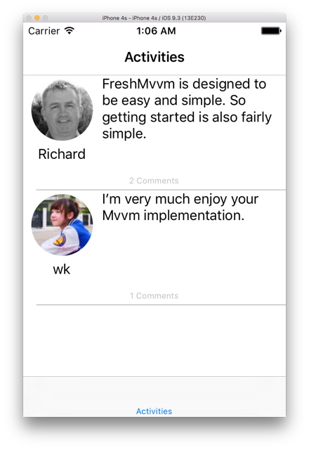

## FreshMVVM



- โปรแกรมมี 2 Page คือ ActivityListPage และ CommentListPage
- ทั้งสอง Page จะมี ViewModel คู่กันคือ ActivityListPageModel และ CommentPageModel
- Page และ ViewModel จะ Link กันอัตโนมัติผ่าน FreshMVVM
- ในโปรแกรมจะมีการใช้ Depedency Injection ผ่าน FreshIOC
- FreshIOC.Container.Register<IActivityService, ActivityService> ();

## โครงสร้างโปรเจค

```
├── FreshMVVMSample
│   ├── App.cs
│   ├── Models
│   │   ├── Activity.cs
│   │   ├── Comment.cs
│   │   └── User.cs
│   ├── PageModels
│   │   ├── ActivityListPageModel.cs
│   │   ├── BasePageModel.cs
│   │   └── CommentListPageModel.cs
│   ├── Pages
│   │   ├── ActivityListPage.xaml
│   │   ├── ActivityListPage.xaml.cs
│   │   ├── CommentListPage.xaml
│   │   └── CommentListPage.xaml.cs
│   ├── Properties
│   │   └── AssemblyInfo.cs
│   ├── Services
│   │   ├── ActivityService.cs
│   │   └── IActivityService.cs
│   └── Utilities
│       ├── CommandReference.cs
│       ├── Gravatar.cs
│       └── MD5.cs
└── FreshMVVMSample.iOS
    ├── AppDelegate.cs
    └── Main.cs
```

## Api ที่เกี่ยวข้อง

- FreshIOC.Container.Register, FreshBasePageModel - https://github.com/rid00z/FreshMvvm

## Link

- http://www.michaelridland.com/xamarin/freshmvvm-quick-start-guide
